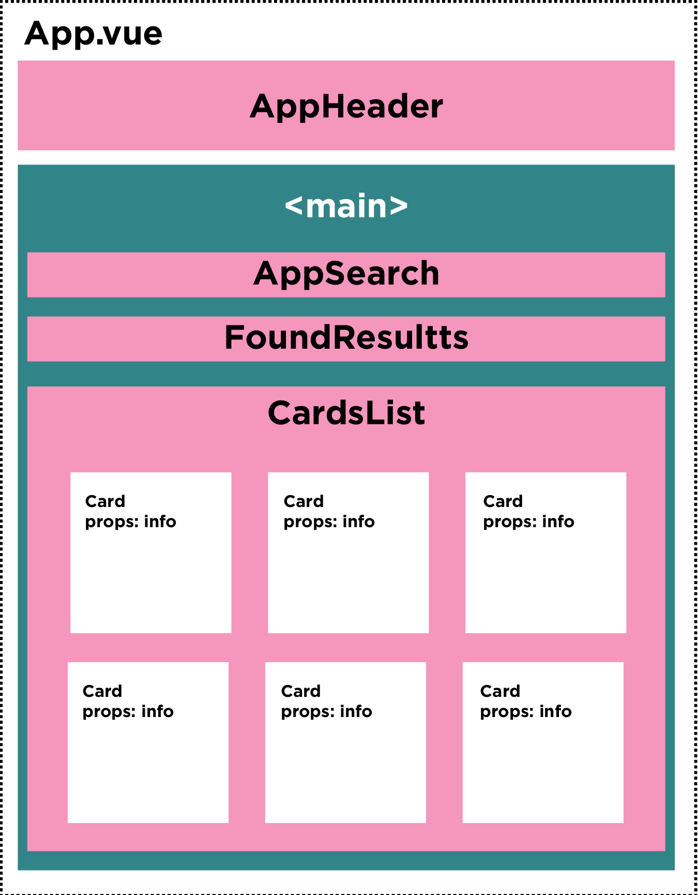

# Vite Yu-Gi-Oh

#### Descrizione:
- Rappresentazione progetto YU-GI-OH API con Vite e Vue 3, definire i componenti necessari per strutturare il layout come da screenshot allegato.

- Al caricamento della pagina, effettuate chiama __ajax__ all'API di Yu Gi Oh [click here](https://db.ygoprodeck.com/api/v7/cardinfo.php)
e con i dati restituiti, stampate una card per ogni carta.
- Scelta font libera ;
- Diagramma di flusso progetto qui sotto:

*ATTENZIONE: l’api restituisce tutti i risultati in un colpo solo. Per evitare attese e/o rallentamenti nelle richieste, potete diminuire il numero di risultati sfruttando i parametri num e offset* (vedi url di esempio, https://db.ygoprodeck.com/api/v7/cardinfo.php?num=20&offset=0).

*DOCUMENTAZIONE API* [click here](https://ygoprodeck.com/api-guide/).

#### Bonus:
- Creare un componente loader da visualizzare fintantoché i risultati non sono pronti.

✨ 12_12_2023